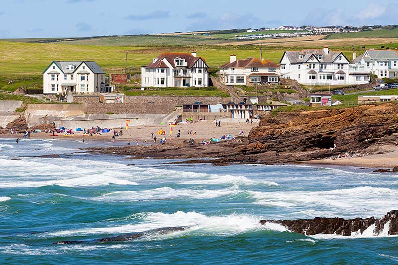
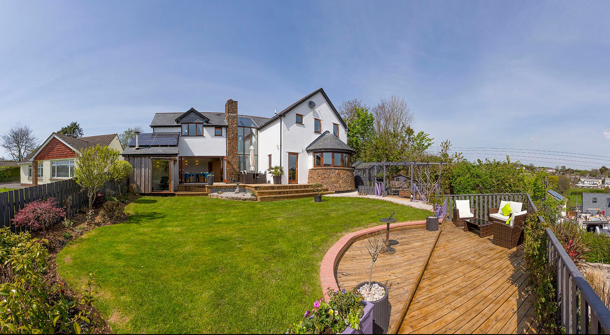
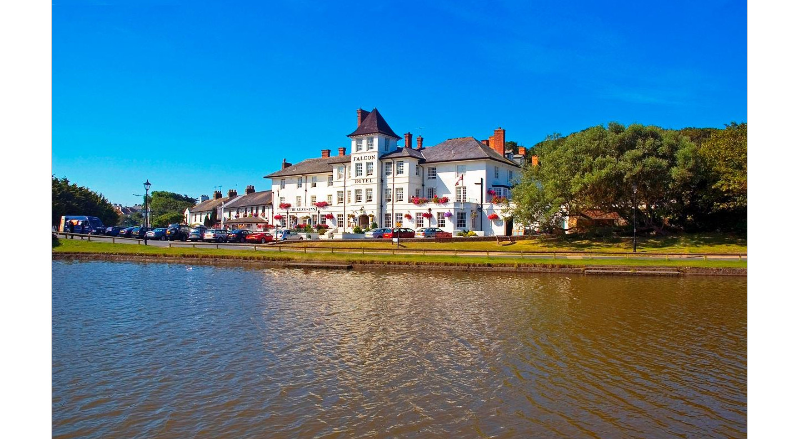
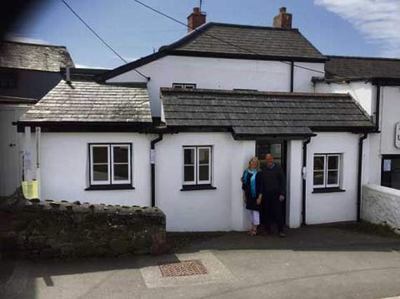

# Set up
First import necessary libraries.
```{r, results="hide"}
library(ggmap)
library(tidyverse)
library(knitr)
```


Bude is a town in Western England, well-known as a beach resort. We find the coordinates using \texttt{geocode()}.
```{r, results = "hide"}
Bude_coord <- geocode("S W Coast Path, Bude EX23 8HN, UK") 
```
I chose the center of the map to be the Bude North Cornwall Cricket Club, as that is the central location of this assignment, and allows for better viewing of the surrounding area. 

# Road map
```{r, results = "hide"}
Bude_roadmap <- get_map(Bude_coord, zoom = 15)
```

```{r}
ggmap(Bude_roadmap)
```

# Watercolor map
```{r, results = "hide"}
Bude_watercolor <- get_map(Bude_coord, maptype = "watercolor", zoom = 15)
```
```{r}
ggmap(Bude_watercolor)
```

# Marking vacation spots
There are a number of good beaches in the Bude area, many of which offer good surfing conditions.

## Two local beaches
### Summerleaze Beach
```{r out.width = "50%"}
include_graphics("summerleaze.jpg")
```

```{r, results = "hide"}
summerleaze <- geocode("Summerleaze Beach, Summerleaze Cres, Bude EX23 8HN, UK")
```
### Crooklets Beach
```{r out.width = "200%"}

```

```{r, results = "hide"}
crooklets <- geocode("Crooklets Beach, S W Coast Path, Bude EX23 8NE, UK")
```
### Cricket grounds (Bude North Cornwall Cricket Club)

"Bude North Cornwall Cricket Club is situated on the clifftops overlooking the Atlantic Ocean, and is quite simply one of the most stunning locations you could ever wish to visit, let alone play cricket at! Bude North Cornwall Cricket Club was founded in 1870. Over the years it has played host to Hockey matches, Tennis, Cricket and even used for Mortar practice in WW2!" [Source.](http://budecc.play-cricket.com/)

```{r out.width = "25%"}
include_graphics("cricket.jpg")
```

```{r, results = "hide"}
cricket_grounds_coord <-geocode("Bude North Cornwall Cricket Club")
```

### Oak Lodge Bed and Breakfast
```{r out.width = "25%"}

```

```{r, results = "hide"}
lodge_coord <-geocode("Stratton, Bude EX23 9AT, England")
```
### Falcon Hotel
```{r out.width = "25%"}

```

```{r, results = "hide"}
hotel_coord <-geocode("Breakwater Road, Bude EX23 8SD, England")
```

### Putting them on the maps
```{r}
ggmap(Bude_roadmap) +
  geom_point(mapping = aes(x = summerleaze$lon, y = summerleaze$lat)) +
  geom_label(x = summerleaze$lon, y = summerleaze$lat, label = "Summerleaze Beach", hjust = 1, vjust=1) +
  geom_point(mapping = aes(x = crooklets$lon, y = crooklets$lat)) +
  geom_label(x = crooklets$lon, y = crooklets$lat, label = "Crooklets Beach", hjust = 1, vjust=1) +
  geom_point(mapping = aes(x = cricket_grounds_coord$lon, y = cricket_grounds_coord$lat)) +
  geom_label(x = cricket_grounds_coord$lon, y = cricket_grounds_coord$lat, label = "Cricket Grounds", hjust = 1, vjust = 1) +
  geom_point(mapping = aes(x = lodge_coord$lon, y = lodge_coord$lat)) +
  geom_label(x = lodge_coord$lon, y = lodge_coord$lat, label = "Oak Lodge Bed and Breakfast", hjust = 1, vjust = 1) +
  geom_point(mapping = aes(x = hotel_coord$lon, y = hotel_coord$lat)) +
  geom_label(x = hotel_coord$lon, y = hotel_coord$lat, label = "Falcon Hotel", hjust = 1, vjust = 1) 
```

```{r}
ggmap(Bude_watercolor) +
  geom_point(mapping = aes(x = summerleaze$lon, y = summerleaze$lat)) +
  geom_label(x = summerleaze$lon, y = summerleaze$lat, label = "Summerleaze Beach", hjust = 1, vjust=1) +
  geom_point(mapping = aes(x = crooklets$lon, y = crooklets$lat)) +
  geom_label(x = crooklets$lon, y = crooklets$lat, label = "Crooklets Beach", hjust = 1, vjust=1) +
  geom_point(mapping = aes(x = cricket_grounds_coord$lon, y = cricket_grounds_coord$lat)) +
  geom_label(x = cricket_grounds_coord$lon, y = cricket_grounds_coord$lat, label = "Cricket Grounds", hjust = 1, vjust = 1)+
  geom_point(mapping = aes(x = lodge_coord$lon, y = lodge_coord$lat)) +
  geom_label(x = lodge_coord$lon, y = lodge_coord$lat, label = "Oak Lodge Bed and Breakfast", hjust = 1, vjust = 1)+
  geom_point(mapping = aes(x = hotel_coord$lon, y = hotel_coord$lat)) +
  geom_label(x = hotel_coord$lon, y = hotel_coord$lat, label = "Falcon Hotel", hjust = 1, vjust = 1) 
```

# Marking route from Bude North Cornwall Cricket Club to The Barrel at Bude

## The Barrel at Bude:
```{r out.width = "75%"}

```
The Barrel at Bude is one of the oldest buildings in Bude and was originally a sea canal worker's house. It was only the second micropub to open in Cornwall.

```{r, results = "hide"}
barrel <- geocode("36 Lansdown Rd, Bude EX23 8BN, UK")
```

## The route:
```{r, results = "hide"}
from <- "Bude North Cornwall Cricket Club"
to <- "36 Lansdown Rd, Bude EX23 8BN, UK"
route_df <- route(from, to, structure = "route")
```

```{r}
ggmap(Bude_roadmap) +
  geom_point(mapping = aes(x = cricket_grounds_coord$lon, y = cricket_grounds_coord$lat)) +
  geom_label(x = cricket_grounds_coord$lon, y = cricket_grounds_coord$lat, label = "Cricket Grounds", hjust = 1, vjust = 1) +
  geom_point(mapping = aes(x = barrel$lon, y = barrel$lat)) +
  geom_label(x = barrel$lon, y = barrel$lat, label = "The Barrel at Bude", hjust = 1, vjust = 1) +  
  geom_path(aes(x = lon, y = lat), colour = "red", size = 1.5,
            data = route_df, lineend = "round")
```

```{r}
ggmap(Bude_watercolor) +
  geom_point(mapping = aes(x = cricket_grounds_coord$lon, y = cricket_grounds_coord$lat)) +
  geom_label(x = cricket_grounds_coord$lon, y = cricket_grounds_coord$lat, label = "Cricket Grounds", hjust = 1, vjust = 1) +
  geom_point(mapping = aes(x = barrel$lon, y = barrel$lat)) +
  geom_label(x = barrel$lon, y = barrel$lat, label = "The Barrel at Bude", hjust = 1, vjust = 1) +  
  geom_path(aes(x = lon, y = lat), colour = "red", size = 1.5,
            data = route_df, lineend = "round")
```

